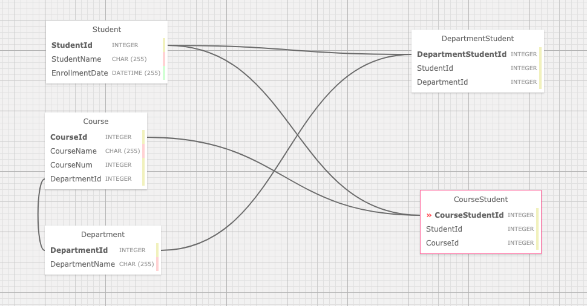

# _PROJECT NAME_

#### _MVC & Entity Practice for Many-to-Many Relationships_

#### By _**KEVIN DAVIS, JOSEPH PEARCE, KYLE HUBBARD, JASON KHAN**_

## Description

_A mock application for a University registrar to keep track of students and courses._

### Specs
| Spec | Input | Output | Done? |
| :-------------     | :------------- | :------------- | :------------- | 
| Program will contain a Student object. | input: | output:  | [ ] |
| Program will contain a Student object with Student Name and Date of Enrollment. | input: {Name: "Kyle", Date: "5/3/1976"} | output:  | [ ] |
| Program will contain a Course object. | input: | output:  | [ ] |
| Program will contain a Course object with Course Name and Course Number. | input: {Name: "World of Kyle", Number: "8000"} | output:  | [ ] |
| Program will allow the user to assign students to a course.  | input: | output:  | [ ] |
| Program will allow a Course to contain many students. | input: | output:  | [ ] |
| Program will allow a Student to take as many courses as they want. | input: | output:  | [ ] | 

## Database Table Relationships

## Setup/Installation Requirements

* _Visit the following link: _
* _Clone the repository to your desired directory._
* _OR_
* _Visit here: _

## Known Bugs

_No known bugs at this time._

## Support and contact details

_For questions, comments, or collaboration contact me at thekidnamedkd@gmail.com_

## Technologies Used

* _ASP/.NET_
* _C#_
* _Entity_
* _Git_
* _HTML_
* _CSS_
* _SQL_

### License

*GPL license distribution*

Copyright (c) 2020 **_Kevin Davis, Joseph Pearce, Kyle Hubbard_**